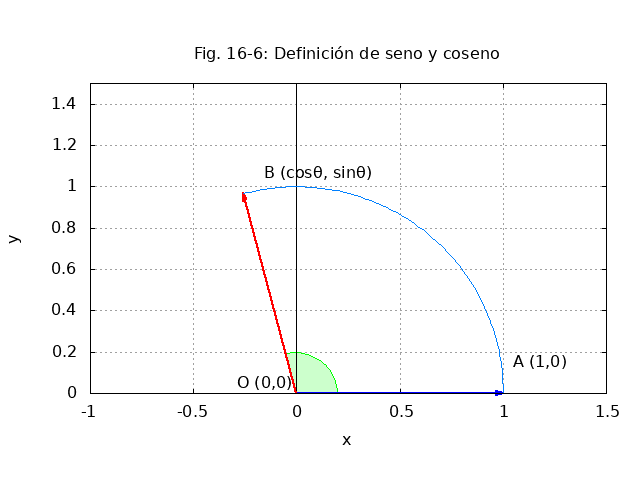

Función seno y coseno
=======================

Se considera un sistema de coordenadas con origen en :math:`O` y un punto :math:`A` en :math:`(1,0)`. Se rota la flecha :math:`OA` sobre un ángulo de theta (:math:`θ`) grados hacia una nueva posición en :math:`OB`. Ver figura 16-6.

1. La función :math:`coseno(θ)` está definida como la coordenada :math:`x` del punto :math:`B`.
2. La función :math:`seno(θ)` está definida como la coordenada :math:`y` del punto :math:`B`.

   Fig. 16-6 - Rotación del punto A al punto B mediante ángulo θ

Alternativamente, aquí hay una representación ASCII del diagrama:

::

     y │
       │ B(cosθ, senθ)
       │    *
       │   / \
       │  /   \
       │ /     \
       │/ θ     \
     O ┼──────────* A(1,0)
       │         x
       │
       │

Notas:

- \( O \) es el origen (0,0)
- \( A \) está en (1,0)
- \( B \) es la rotación de \( A \) por ángulo θ
- La distancia \( OA = OB = 1 \) (radio del círculo unitario)
