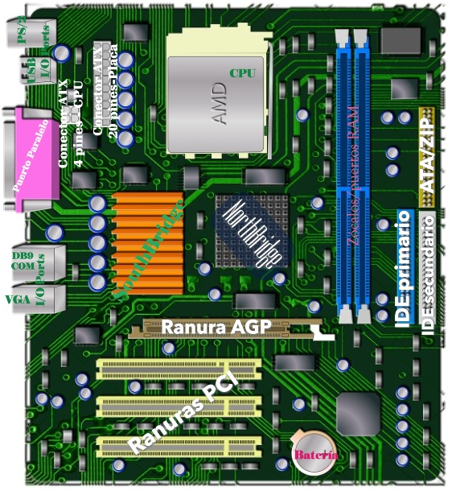

Ejercicios
==============

Ejercicio 1.1: Identificación de Componentes de un Ordenador
---------------------------------------------------------------

Dada una imagen de la placa base de un ordenador, identifica y etiqueta los siguientes componentes:

- **CPU** (Unidad Central de Procesamiento)
- **Memoria RAM** (Módulos de memoria)
- **Ranuras de expansión** (AGP, PCI)
- **Chipset** (Northbridge y Southbridge, si aplica, o un único chipset moderno)
- **Conectores de almacenamiento** (IDE, SATA, M.2)
- **Conectores de alimentación** (ATX de 24 pines, conector de CPU de 4/8 pines)
- **Puertos de E/S** (USB, Ethernet, Audio, etc.)

.. note::

    **Objetivo:** Reforzar el conocimiento práctico de los componentes físicos que conforman un sistema informático mediante la identificación visual y etiquetado de los principales elementos de una placa base. Este ejercicio te permitirá familiarizarte con la disposición y función de cada componente, facilitando su reconocimiento en situaciones reales.

-----

-----

Ejercicio 1.2: Diagrama de la Arquitectura de Von Neuman
------------------------------------------------------------

- Unidad aritmético-lógica(**ALU**): Se encarga de realizar la operaciones aritméticas y lógicas usando el álgebra de *Boole* y circuitos integrados. Las puertas lógicas en el hardwaare de la ALU (AND, OR, NOT, ...) son implementaciones físicas del *álgebra deBoole*.

- Unidad de control(**UC**): Lee y decodifica las instrucciones de los programas almacenados en memoria generando señales lógicas que realizarán modigicaciones sobre los registros de la memoria principal.

- Memoria principal(**RAM**): Son un conjunto de elementos que permiten almacenar y recuperar la información. Los registros son áreas de memoria que permiten almacenar la información temporalmente para operaciones inmediatas; operandos para la ALU, direcciones de memoria, resultados intermedios. 

- Dispositivos de Entrada/Salida(**E/S**): Un sistema está compuesto por múltiples sistemas menores o subsistemas, todos ellos se comunican entre sí mediante las unidades de etrada/salida. Las entradas son señales recibidas, mientras que las salidas son señales enviadas.

- Buses de comunicación(**BUS**): EL bus es un canal, o sistema de comunicación digital, entre componentes de una computadora. El conjunto de líneas de transmisión formadas por cables, pistas en un circuito impreso o conexiones electrónicas, se ocupan de transportar las señales eléctricas entre los distintos componentes de hardware.

-----

Ejercicio 1.3: Comparativa de Buses de Expansión: PCIe vs USB vs SATA
------------------------------------------------------------------------

Tecnologías Analizadas:
- PCI Express (PCIe) 3.0, 4.0 y 5.0.
- USB 2.0, 3.2 Gen 1/Gen 2 y 4.0.
- SATA 3.0.

Tabla Comparativa
-----------------

+------------+----------------+---------------------+-----------------+------------------------+------------------------------------+
| Tecnología |     Versión    | Ancho de Banda Máx. |   Topología     |   Velocidad Transfer.  |             Usos Típicos           |
+============+================+=====================+=================+========================+====================================+
|    PCIe    |       3.0      |   985 MB/s/carril   | Punto a punto   |          8 GT/s        |     GPUs, NVMe, tarjetas de red    |
+------------+----------------+---------------------+-----------------+------------------------+------------------------------------+
|            |       4.0      |   1.97 GB/s/carril  | Punto a punto   |         16 GT/s        |     GPUs modernas, SSDs PCIe 4.0   |
+------------+----------------+---------------------+-----------------+------------------------+------------------------------------+
|            |       5.0      |   3.94 GB/s/carril  | Punto a punto   |         32 GT/s        | GPUs gama alta, SSDs ultrarrápidos |
+------------+----------------+---------------------+-----------------+------------------------+------------------------------------+
|    USB     |       2.0      |   60 MB/s           |   Compartido    |        480 Mbps        |        Periféricos básicos         |
+------------+----------------+---------------------+-----------------+------------------------+------------------------------------+
|            |    3.2 Gen 1   |   625 MB/s          |   Compartido    |          5 Gbps        |          Discos externos           |
+------------+----------------+---------------------+-----------------+------------------------+------------------------------------+
|            |    3.2 Gen 2   |   1.25 GB/s         |    Dedicado     |         10 Gbps        |            SSDs externos           |
+------------+----------------+---------------------+-----------------+------------------------+------------------------------------+
|            |    4.0         |   5 GB/s            | Punto a punto   |         40 Gbps        |      Monitores 8K, NVMe externos   |
+------------+----------------+---------------------+-----------------+------------------------+------------------------------------+
|   SATA     |    3.0         |   600 MB/s          | Punto a punto   |          6 Gbps        |         HDDs, SSDs económicos      |
+------------+----------------+---------------------+-----------------+------------------------+------------------------------------+

Claves Técnicas
---------------

PCI Express
~~~~~~~~~~~
- Escalabilidad: Rendimiento multiplicado por carriles (x1, x4, x8, x16).
- Latencia ultra-baja para componentes críticos.
- Evolución: Cada versión duplica el ancho de banda.

USB
~~~
- Retrocompatibilidad entre versiones.
- USB4 unifica protocolos Thunderbolt.
- Alimentación eléctrica integrada (hasta 240W en USB PD 3.1).

SATA
~~~~
- Protocolo optimizado para almacenamiento.
- Sustituido progresivamente por NVMe en SSDs.
- Sigue siendo estándar en HDDs mecánicos.

Recomendaciones de Uso
----------------------

1. Máximo rendimiento (GPU/SSD).
   - PCIe 5.0 x16 (63 GB/s teóricos).
   
2. Almacenamiento externo.
   - USB4 para NVMe externo.
   - USB 3.2 Gen 2 para SSDs SATA.

3. Equilibrio costo-rendimiento.
   - PCIe 4.0 para la mayoría de usuarios.
   - SATA 3.0 para HDDs y SSDs secundarios.

Notas Adicionales
------------------

- GT/s = GigaTransfers por segundo (no equivalente directo a GB/s).
- Los anchos de banda reales son ~20% menores por overhead de protocolo.
- Thunderbolt 3/4 comparte connector USB-C pero usa protocolo PCIe.

-----

Ejercicio 1.4: Configuración de un equipo informático
--------------------------------------------------------

**Descripción**: Realice tres presupuestos de pc: 
   - 1º. Equipo para un cliente que va a utilizar aplicaciones web y de ofimática. No sobrepasar los 600€.
   - 2º. Equipo para un cliente que va a utilizar aplicaciones de renderizado 3D (Blender 3D, Rhino3D, 3D Studio Max). No sobrepasar los 2.000€.
   - 3º. Equipo para un cliente que va a utilizar para jugar a juegos como Call of Duty. No sobrepasar los 2.500€.

Pueden utilizar la página web www.pccomponentes.com en el apartado :kbd:`Ordenadores` - :kbd:`Configurador de PCs` para realizar el ejercicio.

Para la entrega del ejercicio, hacer un documento de Word o de Excel con las características de cada equipo.

Objetivo: Capacitar para confeccionar equipos según las necesidades del cliente

----

1º Aplicaciones web y de ofimática
--------------------------------------

- **PROCESADOR** Intel Core i3-10100 3.60 GHz -- 103.91€.
- **PLACA BASE** Gigabyte H410M H V2 --- 61.55€.
- **MEMORIA RAM** Adata Premier DDR4 2666MHz PC4-21300 8GB CL19 47.98€(Precio por unidad 23.99€).
- **CAJA/TORRE** Alurin Work Torre ATX Negra + Fuente de Alimentación 500W -- 48.99€.
- **REFRIGERACIÓN CPU** Tempest Cooler 3Pipes 120mm Ventilador CPU Basic 15.98€.
- **FUENTE DE ALIMENTACIÓN** *incluida en la caja(500W)*.
- **TARJETA GRÁFICA** MSI GeForce GT710 2GB DDR3 Low Profile 46.34€.
- **DISCO DURO** MSI SPATIUM M371 SSD 500GB NVMe M.2 Gen3x4 36.99€.

Periféricos
~~~~~~~~~~~~~

- **MONITOR** Nilox NXM24FHD1201 23.8" LED VA FullHD 120Hz 73.99€.
- **TECLADO** NGS Funky V3 Teclado USB Multimedia Plug & Play 1.4m Qwerty Español Negro 7.19€.
- **RATÓN** HP X1500 Ratón Negro USB 2.99€.
- **ALTAVOCES** Hama Altavoz Sonic Mobil 183 2.0 USB Negros 9.29€.

2ª Aplicaciones de renderizado 3D
--------------------------------------

- **PROCESADOR** AMD Ryzen 7 5800X 3.8GHz -- 144.90€
- **PLACA BASE** PLACA BASE MSI B550M PRO-VDH WIFI -- 116.47€
- **MEMORIA RAM** Lexar LD4BU016G-R3200GDXG DDR4 3200MHz 32GB 2X16GB CL19 108.98€
- **CAJA/TORRE** Nox Hummer Horus ARGB E-ATX Cristal Templado USB 3.0 Negra 59.42€
- **REFRIGERACIÓN CPU** DeepCool AK620 Zero Dark Ventilador CPU 120mm Negro 68.99€
- **FUENTE DE ALIMENTACIÓN** Corsair CX750 750 W 80 Plus Bronze 74.90€
- **TARJETA GRÁFICA** MSI GeForce RTX 3050 VENTUS 2X XS OC 8GB GDDR6 218.99€
- **DISCO DURO PRINCIPAL** Samsung 990 EVO Plus 1TB Disco SSD 7150MB/s NVME PCIe 5.0 x2 NVMe 2.0 NAND 78.99€
- **DISCO DURO SECUNDARIO** Seagate SkyHawk 2TB 3.5" SATA 3 64.13€

Periféricos
~~~~~~~~~~~~~

- **MONITOR** AOC Q24G4RE 23.8" Fast IPS QHD 180Hz HDR10 Adaptive Sync 154.99€
- **TECLADO** TECLADO Logitech K120 Teclado USB Negro 14.25€
- **RATÓN** Logitech G203 Lightsync 2nd Gen Ratón Gaming 8000DPI RGB Negro 21.99€

**TOTAL**: 1.127,00€

-----

3º Juegos como Call of Duty
----------------------------

- **PROCESADOR** Intel Core i7-12700KF 3.6 GHz -- 229.69€
- **PLACA BASE** MSI B760 GAMING PLUS WIFI -- 169.90€
- **MEMORIA RAM** Corsair Vengeance DDR5 6000MHz 32GB 2x16GB CL30 Memoria Dual AMD EXPO e Intel XMP -- 124.99€
- **CAJA/TORRE** Abysm Gaming Danube Kamp BX300 Full Tower Cristal Templado USB-C Negra -- 105.95€
- **REFRIGERACIÓN CPU** Corsair A115 Ventilador CPU Negro -- 100.95€
- **FUENTE DE ALIMENTACIÓN** MSI MAG A850GL PCIE5 II ATX 3.1 850W 80 Plus Gold Modular -- 98.99€
- **TARJETA GRÁFICA** INNO3D GeForce RTX 4060 TWIN X2 Nighthawk 8GB GDDR6 DLSS3 -- 309.99€
- **DISCO DURO PRINCIPAL** Samsung 970 EVO Plus 1TB NVMe M.2 -- 129.99€
- **DISCO DURO SECUNDARIO** Seagate BarraCuda 4TB Disco interno HDD 3.5" SATA3 -- 98.76€

Periféricos
~~~~~~~~~~~~~

- **MONITOR** ASUS TUF Gaming VG27AQM1A 27" LED Fast IPS QHD 260Hz G-Sync Compatible -- 329€
- **TECLADO** Razer BlackWidow V3 TKL Teclado Gaming Retroiluminado Yellow Switch -- 89.99€
- **RATÓN** Razer DeathAdder V2 X HyperSpeed Ratón Gaming 6400 DPI Negro -- 39.99€
- **ALTAVOCES** Logitech Z623 Altavoces con Subwoofer 200W RMS -- 130€

**TOTAL**: 2010,10€ (montaje, soporter premium 365 + técnico a domicilio).

