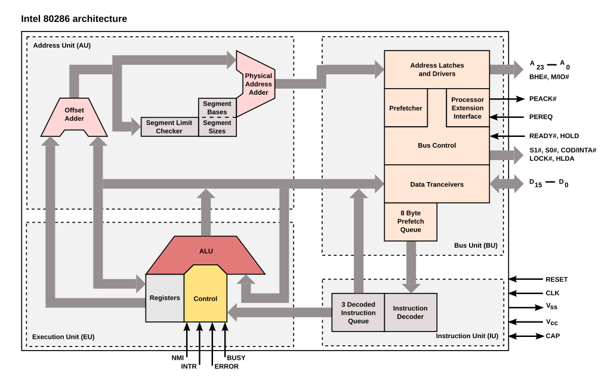

La arquitectura Von Neumann
==============================

La arquitectura Von Neumann es también conocida como modelo de Von Neumann o arquitectura Princeton.
Es un modelo de diseño para computadoras propuesto por **John Von Neumann** en 1945. Es la base de la mayoría de las computadoras modernas.

Características principales:
------------------------------

1. **Unidad de memoria única**:

- Almacena tanto **instrucciones (programas)** como **datos** en el mismo espacio de memoria.

2. **Unidad Central de Procesamiento (CPU)**:

- Se encarga de ejecutar las instrucciones. Está compuesta por:

  - **Unidad de Control**: Interpreta las instrucciones.
  - **Unidad Aritmético-Lógica (ALU)**: Realiza operaciones matemáticas y lógicas.

3. **Ejecución secuencial**:

- Las instrucciones se ejecutan una tras otra, en orden, a menos que haya instrucciones de salto.

4. **Sistema de entrada/salida (E/S)**:

- Permite la comunicación entre la computadora y el exterior (teclado, pantalla, etc.).

5. **Bus de datos y direcciones**:

- Permiten el transporte de datos e instrucciones entre la memoria, la CPU y los dispositivos de E/S.

.. figure:: ../descargas/arch.png
   :alt: Diagrama arquitectura Von Neumann
   :width: 250px
   :align: left

.. figure:: ../descargas/archCPU.png
   :alt: Diagrama arquitectura Von Neumann
   :width: 250px
   :align: right

Ventajas:
-----------

- Simplicidad y flexibilidad del diseño.
- Facilita la programación y la construcción de computadoras.

Desventajas:
---------------

- **Cuello de botella de Von Neumann**: La CPU y la memoria comparten el mismo bus, lo que limita la velocidad de transferencia de datos e instrucciones.

En resumen, la arquitectura de Von Neumann describe un sistema informático con una sola memoria para datos e instrucciones, donde un procesador ejecuta instrucciones de forma secuencial.

*bibliografía*: https://es.wikipedia.org/wiki/Arquitectura_de_Von_Neumann

Soluciones Modernas
---------------------

1. **Memoria Caché (L1, L2, L3)**

   - Almacena datos e instrucciones frecuentes cerca del CPU.
   - L1 (por núcleo, separada en instrucciones/datos).
   - L2 (por núcleo o compartida).
   - L3 (compartida entre todos los núcleos).

2. **Arquitectura Harvard Modificada**

   - Buses separados para datos e instrucciones **solo en caché** (L1).
   - En RAM sigue siendo *la arquitectura de Von Neumann*.

3. **Prefetching**

   - Predice y carga datos antes de que el CPU los solicite.

4. **Pipelines y Ejecución Paralela**

   - Procesamiento simultáneo de múltiples instrucciones.

5. **Memorias Rápidas**

   - DDR5, HBM (High Bandwidth Memory), GDDR6.

6. **Multi-Núcleo y Multihilo**

   - Distribuye la carga entre varios núcleos/hilos.

Esquema de un Procesador Moderno
-----------------------------------

::

    +---------------------------------------------------+
    |                  CPU Multicore                    |
    | +-----------+    +-----------+    +-----------+   |
    | | Core 1    |    | Core 2    |    | Core N    |   |
    | |+---------+|    |+---------+|    |+---------+|   |
    | ||   ALU   ||    ||   ALU   ||    ||   ALU   ||   |
    | |+---------+|    |+---------+|    |+---------+|   |
    | ||Registros||    ||Registros||    ||Registros||   |
    | |+---------+|    |+---------+|    |+---------+|   |
    | +-----^-----+    +-----^-----+    +-----^-----+   |
    |       |                |                |         |
    | +-----v---------------------------------v---+     |
    | |             Caché L3 compartida           |     |
    | +----------------------^--------------------+     |
    | |                      |                          |
    | +----------------+     |   +----------------+     |
    | | Caché L1 (I/D) <-----+-----> Caché L2     |     |
    | +----------------+         +----------------+     |
    +---------------------------------------------------+
               |                        ^
               v                        |
    +---------------------------------------------------+
    |              Controlador de Memoria               |
    | +----------------+ +----------------+             |
    | |  Prefetching   | | DDR5 / HBM     |             |
    | +----------------+ +----------------+             |
    +---------------------------------------------------+
                              |
                              v
                       +----------------+
                       |       RAM      |
                       +----------------+

Componentes Clave
-------------------
- **Núcleos (Cores)**
  - Cada uno con ALU, registros y caché L1 (Harvard modificado).
- **Caché L2**
  - Por núcleo o compartida.
- **Caché L3**
  - Compartida para reducir accesos a RAM.
- **Controlador de Memoria**
  - Gestiona prefetching y comunicación con RAM.
- **RAM**
  - Sigue modelo Von Neumann, pero con buses de alta velocidad (DDR5).

Conclusión
------------

Las técnicas modernas combinan:

- Separación de buses en caché (Harvard).
- Jerarquía de memoria (caché L1/L2/L3).
- Paralelismo (multi-núcleo, pipelines).

Para mitigar el cuello de botella manteniendo compatibilidad.

